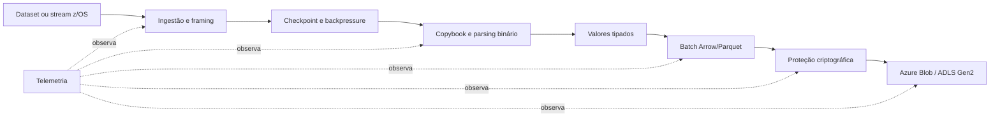

# Análise e reconstrução da ideia do projeto

> Análise realizada em 2 de setembro de 2026 a partir do README, código-fonte,
> configurações, dependências, histórico Git, reflog e referências técnicas citadas
> pelo próprio projeto.

## Confirmação do entendimento

Sim: a ideia central do projeto está clara.

O **M2C Binary ETL Engine** pretende ser um pipeline de ETL em Rust que recebe
registros binários produzidos em ambientes IBM z/OS, interpreta o layout descrito
por copybooks COBOL, converte representações legadas como EBCDIC, inteiros
big-endian e COMP-3 em dados tipados, gera arquivos Apache Parquet e os envia para
Azure Blob Storage/Data Lake. Antes do envio, o projeto pretende proteger o dado
com criptografia híbrida pós-quântica baseada em ML-KEM. Ao mesmo tempo, cada
etapa publica métricas para observabilidade e, futuramente, detecção de anomalias.

Em uma frase: **retirar do mainframe o custo de transformar dados legados e criar
uma ponte segura, eficiente e observável entre dados binários z/OS e analytics na
nuvem**.

A confiança nesse entendimento é alta para o objetivo central e para o fluxo de
dados. Permanecem indefinidos o protocolo real de ingestão, o subconjunto de COBOL
aceito, como o consumidor descriptografará os dados e o que exatamente será o
componente de IA do AIOps.

## A intuição que provavelmente originou o projeto

O projeto combina quatro problemas que normalmente aparecem separados:

1. **Modernização sem substituir o mainframe.** Em vez de tentar remover o z/OS,
   o sistema transfere para uma máquina distribuída o trabalho de decodificar e
   preparar dados para analytics. Isso pode reduzir processamento cobrado no
   mainframe e encurtar o caminho até a nuvem.
2. **Preservação semântica.** Um arquivo binário só se torna útil quando o sistema
   conhece o copybook, a página de código, o tipo de cada campo, sua escala, sinal,
   tamanho e representação. A proposta é converter essa semântica em um schema
   Parquet consumível sem conhecimento do layout original.
3. **Proteção de dados de longa duração.** Dados financeiros podem precisar
   permanecer confidenciais por muitos anos. O uso de ML-KEM tenta mitigar o
   cenário “harvest now, decrypt later”, no qual tráfego capturado hoje seria
   decifrado no futuro.
4. **Operação mensurável.** Throughput, erros de parsing, latência de transformação,
   custo criptográfico e escrita no destino seriam observados de ponta a ponta.
   As séries temporais poderiam alimentar alertas e, em uma etapa posterior,
   modelos de detecção de anomalias.

Isso é uma boa combinação para um projeto de portfólio de engenharia de sistemas:
há parsing binário, modelagem de tipos, concorrência assíncrona, armazenamento
colunar, integração nativa/FFI, criptografia e observabilidade. O risco é tentar
entregar todas essas frentes simultaneamente antes de existir uma fatia vertical
funcional.

## Fluxo reconstruído



O fluxo acima é uma inferência consistente com as APIs existentes. A ordem exata
entre serialização Parquet e criptografia ainda precisa ser escolhida. Para manter
compressão e leitura seletiva, a opção tecnicamente mais interessante é avaliar a
[criptografia modular do próprio Parquet](https://parquet.apache.org/docs/file-format/data-pages/encryption/),
em vez de transformar todo o arquivo em um blob opaco.

## O que já existe no repositório

O repositório tem 333 linhas de Rust, distribuídas em uma biblioteca e um binário.
Há sete módulos com **25 chamadas `todo!()`**. Portanto, o trabalho existente é um
desenho de interfaces, não uma implementação funcional.

| Área | Evidência no skeleton | Estado real |
|---|---|---|
| `ingestion` | Configuração de origem, endpoint, cursor, conexão, leitura e commit | Apenas tipos e assinaturas |
| `parser` | Copybook simplificado, parser EBCDIC, inteiro big-endian, COMP-3 e slicing zero-copy | Cinco `todo!()`; alteração local em andamento |
| `transform` | Construção do engine, leitura de copybook, transformação e Parquet | Quatro `todo!()`; ainda não produz valores tipados |
| `crypto` | Configuração de KEM, envelope, encapsulação e decapsulação | Três `todo!()`; `oqs` não é usado pelo módulo |
| `sink` | Batch, partição, retry, escrita e finalização | Interface abstrata ainda sem trait e sem implementação |
| `cloud` | Configuração e upload para Azure Blob | Três `todo!()`; não há SDK Azure nas dependências |
| `telemetry` | Snapshot e exportação Prometheus | Quatro `todo!()`; não há biblioteca de métricas nas dependências |
| `main` | Runtime Tokio | Apenas retorna `Ok(())`; nenhum estágio é ligado |
| `error` | Erros previstos para todas as camadas | É a parte mais completa, mas ainda não é exercitada |

As dependências confirmam a direção pretendida:

- `tokio` para runtime, canais e controle assíncrono;
- `byteorder` para leitura explícita de big-endian;
- `serde` e `thiserror` para configuração/modelos e erros;
- `parquet` com Arrow, Snappy e Zstandard;
- `oqs` opcional, ativado pela feature `pqc`.

No lockfile, entre outras, estão fixadas `parquet 53.4.1`, `oqs 0.10.1`,
`tokio 1.52.1`, `byteorder 1.5.0`, `serde 1.0.228` e `thiserror 2.0.18`.
O crate usa Rust edition 2024. As configurações do Cargo e do editor Zed indicam
desenvolvimento em Windows com toolchain MSVC/Visual Studio.

## Estado verificável em 2 de setembro de 2026

- `cargo check`: passa no conjunto padrão de features.
- `cargo test`: passa, mas executa **zero testes**.
- `cargo clippy --all-targets -- -D warnings`: passa.
- `cargo fmt --all -- --check`: falha por whitespace em uma alteração local de
  `src/parser/mod.rs`.
- `cargo check --features pqc`: falha no build do `oqs-sys` porque `libclang` não
  está disponível/configurado no ambiente.
- O branch local `main` e `origin/main` apontam para o mesmo commit; não existem
  outros branches remotos nem tags.
- O histórico útil contém quatro commits, todos de 29 de abril de 2026. Os dois
  commits abandonados visíveis no reflog alteravam somente o copyright da licença;
  não há implementação perdida neles.
- Há alterações locais não commitadas em `Cargo.toml` e `src/parser/mod.rs`, além
  do documento não rastreado `docs/architecure.md`. Esta análise não modificou
  esses arquivos.

O README atual contradiz o código ao afirmar que parsing, endianness e integração
PQC estão implementados. Também diz que a solução não é uma prova de conceito,
embora todos os caminhos operacionais terminem em `todo!()`. O README deve ser
ajustado cedo para preservar a credibilidade do portfólio.

## Decisões técnicas importantes antes de implementar

### 1. Definir o contrato de entrada

“Dados do mainframe” ainda é amplo demais. É necessário escolher inicialmente uma
origem concreta, por exemplo:

- arquivo local exportado de um dataset sequencial de registros fixos;
- arquivo VB com RDW/BDW;
- fila IBM MQ;
- transferência em lote por SFTP/Connect:Direct;
- integração de CDC.

Para o primeiro MVP, um arquivo local com registros fixos e um copybook real é a
melhor opção. Ela permite provar a transformação corretamente antes de introduzir
rede, credenciais, retries e commits distribuídos.

### 2. Modelar copybook e valores tipados de verdade

`CopybookFieldDef { name, offset, length, picture }` não representa elementos
essenciais: nível hierárquico, `USAGE`, sinal, escala implícita (`V`), página de
código, grupos, `OCCURS`, `REDEFINES`, `SYNC`, `DEPENDING ON`, fillers e layouts
alternativos. A documentação da IBM mostra que até o subconjunto comum distingue
DISPLAY, BINARY/COMP e PACKED-DECIMAL/COMP-3 e possui regras próprias de tamanho
e sinal: [tipos de copybook COBOL](https://www.ibm.com/docs/en/ims/15.4.0?topic=dtsj-cobol-copybook-types-that-map-java-data-types).

Também há uma lacuna entre `ParsedField`, que guarda apenas `&[u8]`, e a promessa
de produzir dados estruturados. O core precisa de algo equivalente a:

```rust
enum Value<'a> {
    Text(Cow<'a, str>),
    Integer(i64),
    Decimal { unscaled: i128, scale: u8 },
    Bytes(&'a [u8]),
    Null,
}
```

O zero-copy deve ser uma otimização seletiva, principalmente para bytes. Texto
EBCDIC convertido em UTF-8 geralmente precisará de outro buffer. Para valores
financeiros, `i64` sem escala não basta como contrato público; convém preservar
valor não escalado + escala ou usar um tipo decimal apropriado.

### 3. Tratar endianness por campo, não pelo arquivo inteiro

O mainframe ser big-endian não significa inverter todos os bytes. Campos DISPLAY
e COMP-3 não passam por uma simples troca de endianness; campos BINARY/COMP exigem
leitura conforme tamanho, sinal e dialeto. Depois de convertido em valores lógicos,
o escritor Parquet cuida de sua própria representação física.

### 4. Corrigir o desenho criptográfico

[FIPS 203](https://csrc.nist.gov/pubs/fips/203/final) define ML-KEM como um
mecanismo para estabelecer um segredo compartilhado. ML-KEM não deve ser tratado
como uma cifra direta de payload ou de chave arbitrária. Um envelope coerente
seria:

1. gerar uma DEK aleatória para o batch/arquivo;
2. cifrar e autenticar o Parquet com uma AEAD, como AES-GCM;
3. encapsular com ML-KEM para obter `kem_ciphertext` e `shared_secret`;
4. passar o segredo por uma KDF e usá-lo para proteger a DEK;
5. armazenar versão, algoritmo, key ID, nonces, tags e AAD no envelope;
6. apagar material secreto da memória quando possível.

As APIs atuais `encapsulate_data_key` e `CipherEnvelope` misturam essas etapas e
precisam ser redesenhadas. `kem_algorithm: String` também deveria virar um enum
validado, com uma escolha explícita como ML-KEM-768.

Há ainda um ponto de posicionamento: o próprio projeto Open Quantum Safe descreve
`liboqs` como software de prototipagem e [não recomenda seu uso para proteger dados
sensíveis em produção](https://github.com/open-quantum-safe/liboqs#limitations-and-security).
Logo, `liboqs` é adequado para a demonstração/benchmark do portfólio, mas uma meta
de produção exigiria biblioteca/provedor suportado, revisão criptográfica, gestão
de chaves em KMS/HSM, autenticação do destinatário, rotação e threat model formal.

### 5. Resolver “Parquet cifrado” versus “pronto para analytics”

Um blob totalmente cifrado pelo cliente não fica imediatamente consultável por
engines comuns. É preciso escolher e documentar uma destas opções:

- Parquet modular encryption com integração ao sistema de chaves;
- criptografia do objeto inteiro e um serviço autorizado de decriptação;
- apenas criptografia de transporte + criptografia nativa do Azure em repouso;
- campos/colunas sensíveis cifrados seletivamente.

Sem essa decisão, duas promessas centrais do README — segurança antes do upload e
consumo analítico imediato — entram em conflito.

### 6. Unificar `sink` e `cloud`

Os módulos têm responsabilidades sobrepostas. Uma separação mais clara seria um
trait `Sink` genérico, com implementações `LocalFileSink` e `AzureBlobSink`. Isso
permite testar todo o pipeline localmente. O SDK Azure, autenticação por identidade
gerenciada, checksums, uploads em blocos, retry com jitter, idempotência e commit
de partição ainda precisam ser adicionados.

### 7. Definir semântica de entrega e checkpoint

Já existe a intuição correta de cursor e finalização idempotente, mas o cursor não
acompanha cada registro/batch. O commit da origem só pode ocorrer depois que o
objeto e seu manifesto estiverem duravelmente gravados. O MVP deveria prometer
**at-least-once + escrita idempotente**, que é mais realista do que anunciar
exactly-once sem protocolo transacional entre origem e Azure.

### 8. Separar observabilidade de AIOps

Prometheus/Grafana constituem observabilidade, não IA por si sós. Primeiro devem
existir métricas, labels com cardinalidade controlada, logs estruturados, traces,
SLOs e alertas determinísticos. Depois, um detector de anomalias pode consumir as
séries. Ele precisa de dataset, baseline, método de avaliação e resposta a falso
positivo. A alegação de detectar exfiltração ou falha de hardware apenas por
distribuição de registros deve ser tratada como hipótese experimental.

## Escopo recomendado para conseguir terminar

A melhor estratégia é manter a visão completa, mas entregar primeiro uma fatia
vertical verificável:

### Marco 1 — Parser confiável

- fixtures pequenas com bytes conhecidos e copybooks reais;
- CP037 inicialmente, configurável e com política strict/replacement;
- PIC X, DISPLAY numérico, COMP/BINARY de 2/4/8 bytes e COMP-3;
- validação de limites, sinal, escala e tamanho;
- testes unitários, casos inválidos e property/fuzz tests para o parser binário.

**Pronto quando:** bytes de exemplo viram exatamente os valores esperados e erros
incluem campo e offset.

### Marco 2 — ETL local de ponta a ponta

- CLI: `input.bin + copybook.cpy -> output.parquet`;
- schema intermediário tipado;
- batches Arrow/Parquet com Zstd ou Snappy;
- `LocalFileSink`, manifesto e estatísticas;
- teste que reabre o Parquet e compara os valores.

**Pronto quando:** uma fixture reproduzível gera Parquet válido sem Azure nem PQC.

### Marco 3 — Pipeline assíncrono e recuperável

- mensagens de batch com identidade, cursor e metadados;
- canais Tokio limitados para backpressure;
- limites de memória e concorrência;
- retry apenas em erros transitórios;
- checkpoint depois do commit idempotente do sink.

**Pronto quando:** uma interrupção e retomada não perdem dados nem criam resultados
finais duplicados.

### Marco 4 — Segurança experimental

- especificação versionada do envelope;
- AEAD + KDF + ML-KEM, vetores de teste e testes de adulteração;
- lifecycle/zeroização de chaves;
- benchmark isolando custo de KEM e custo simétrico;
- documentação explícita de protótipo e threat model.

**Pronto quando:** outro processo consegue validar o envelope e recuperar um
Parquet idêntico, enquanto qualquer alteração indevida é rejeitada.

### Marco 5 — Azure e observabilidade

- `AzureBlobSink` com identidade gerenciada e upload multipart/blocos;
- nomes determinísticos, checksums e commit de partição;
- métricas Prometheus e logs/traces por estágio;
- dashboard e alertas básicos;
- teste de integração contra Azurite ou ambiente dedicado.

**Pronto quando:** o mesmo pipeline local envia um lote, retoma após falha e expõe
métricas úteis sem revelar dados ou criar labels de cardinalidade ilimitada.

### Marco 6 — AIOps experimental

- baseline com tráfego conhecido;
- sinais e hipóteses de anomalia claramente definidos;
- avaliação de precisão/recall e falsos positivos;
- integração desacoplada do caminho crítico do ETL.

## Lacunas de engenharia e documentação

Ainda não existem:

- exemplos de copybook e arquivos binários;
- testes, benchmarks ou fuzzing;
- CLI e formato de configuração;
- tipos intermediários realmente decodificados;
- dependências e implementação para Azure, Prometheus, AEAD, KDF e zeroização;
- CI, política de versões e matriz de plataformas;
- threat model, gestão/rotação de chaves e formato versionado do envelope;
- contrato de idempotência, retry, checkpoint e tratamento de dead letters;
- dashboard Grafana, componente de IA ou dataset de anomalias;
- metas mensuráveis de throughput, memória, latência e taxa de erro;
- guia de execução e demonstração reproduzível.

Como detalhe de higiene, o copyright na licença ainda usa colchetes de placeholder,
e o arquivo `architecure.md` tem um erro ortográfico no nome. Nenhum dos dois
impede o desenvolvimento.

## Perguntas que precisam de resposta durante a retomada

1. O objetivo final é um portfólio demonstrável, um protótipo de pesquisa ou um
   candidato a produção?
2. Qual será a primeira fonte concreta: arquivo FB/VB, MQ, SFTP, Connect:Direct ou
   CDC?
3. Qual dialeto/subconjunto de copybook precisa funcionar no MVP?
4. Existe um copybook e uma amostra binária reais, anonimizados, para virarem
   fixtures?
5. O consumidor no Azure precisa consultar Parquet diretamente? Como receberá as
   chaves de decriptação?
6. A exigência é at-least-once idempotente ou existe razão real para exactly-once?
7. Quais são as metas de throughput, tamanho de registro/batch e memória?
8. O AIOps precisa apenas exportar sinais ou também deve implementar e avaliar um
   detector?

## Conclusão

A ideia foi compreendida e é tecnicamente interessante. O núcleo não é “migrar o
mainframe”, mas criar um **adaptador de dados de alta confiança** entre formatos
COBOL/binários e o ecossistema analítico moderno, com segurança de longo prazo e
telemetria como preocupações de primeira classe.

O projeto está, porém, no estágio de arquitetura compilável. O caminho mais curto
para terminá-lo é provar primeiro `arquivo binário + copybook -> Parquet validado`,
com fixtures e testes fortes. PQC, Azure e AIOps devem entrar como camadas
incrementais depois que essa espinha dorsal estiver correta. Essa ordem preserva a
ambição original e reduz drasticamente o risco de o projeto voltar a parar por
excesso de escopo.
